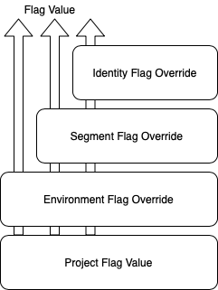

<br/><br/><br/><br/><br/><br/><br/><br/><br/><br/>

```java
/*
 /$$$$$$$$ /$$                                             /$$   /$$     /$$             /$$$$$$$$                  /$$             /$$$$$$$$        /$$ /$$      
| $$_____/| $$                                            |__/  | $$    | $$            |__  $$__/                 | $$            |__  $$__/       | $$| $$      
| $$      | $$  /$$$$$$   /$$$$$$   /$$$$$$$ /$$$$$$/$$$$  /$$ /$$$$$$  | $$$$$$$          | $$  /$$$$$$   /$$$$$$$| $$$$$$$          | $$  /$$$$$$ | $$| $$   /$$
| $$$$$   | $$ |____  $$ /$$__  $$ /$$_____/| $$_  $$_  $$| $$|_  $$_/  | $$__  $$         | $$ /$$__  $$ /$$_____/| $$__  $$         | $$ |____  $$| $$| $$  /$$/
| $$__/   | $$  /$$$$$$$| $$  \ $$|  $$$$$$ | $$ \ $$ \ $$| $$  | $$    | $$  \ $$         | $$| $$$$$$$$| $$      | $$  \ $$         | $$  /$$$$$$$| $$| $$$$$$/ 
| $$      | $$ /$$__  $$| $$  | $$ \____  $$| $$ | $$ | $$| $$  | $$ /$$| $$  | $$         | $$| $$_____/| $$      | $$  | $$         | $$ /$$__  $$| $$| $$_  $$ 
| $$      | $$|  $$$$$$$|  $$$$$$$ /$$$$$$$/| $$ | $$ | $$| $$  |  $$$$/| $$  | $$         | $$|  $$$$$$$|  $$$$$$$| $$  | $$         | $$|  $$$$$$$| $$| $$ \  $$
|__/      |__/ \_______/ \____  $$|_______/ |__/ |__/ |__/|__/   \___/  |__/  |__/         |__/ \_______/ \_______/|__/  |__/         |__/ \_______/|__/|__/  \__/
                         /$$  \ $$                                                                                                                                
                        |  $$$$$$/                                                                                                                                
                         \______/                                                                                                                                 
*/
```

1. Flagsmith demo
1. Integrating with SpringBoot
1. Q/A


<br/><br/><br/><br/><br/><br/><br/><br/><br/><br/><br/><br/><br/><br/><br/><br/><br/><br/><br/><br/><br/><br/><br/><br/><br/><br/><br/><br/><br/><br/><br/><br/><br/><br/>

```java
/*
  /$$$$$$                                           /$$                        
 /$$__  $$                                         |__/                        
| $$  \ $$ /$$    /$$ /$$$$$$   /$$$$$$  /$$    /$$ /$$  /$$$$$$  /$$  /$$  /$$
| $$  | $$|  $$  /$$//$$__  $$ /$$__  $$|  $$  /$$/| $$ /$$__  $$| $$ | $$ | $$
| $$  | $$ \  $$/$$/| $$$$$$$$| $$  \__/ \  $$/$$/ | $$| $$$$$$$$| $$ | $$ | $$
| $$  | $$  \  $$$/ | $$_____/| $$        \  $$$/  | $$| $$_____/| $$ | $$ | $$
|  $$$$$$/   \  $/  |  $$$$$$$| $$         \  $/   | $$|  $$$$$$$|  $$$$$/$$$$/
 \______/     \_/    \_______/|__/          \_/    |__/ \_______/ \_____/\___/ 
*/
```

- Architecture
- Local deployment
- Read project flags
- Read user flags
- Update user flags using traits and segments
- Best Practices

<br/><br/><br/><br/><br/><br/><br/><br/><br/><br/><br/><br/><br/><br/><br/><br/><br/><br/><br/><br/><br/><br/><br/><br/><br/><br/><br/><br/><br/><br/><br/><br/><br/><br/><br/><br/><br/><br/><br/>

```java
/*
  /$$$$$$                      /$$       /$$   /$$                           /$$                                  
 /$$__  $$                    | $$      |__/  | $$                          | $$                                  
| $$  \ $$  /$$$$$$   /$$$$$$$| $$$$$$$  /$$ /$$$$$$    /$$$$$$   /$$$$$$$ /$$$$$$   /$$   /$$  /$$$$$$   /$$$$$$ 
| $$$$$$$$ /$$__  $$ /$$_____/| $$__  $$| $$|_  $$_/   /$$__  $$ /$$_____/|_  $$_/  | $$  | $$ /$$__  $$ /$$__  $$
| $$__  $$| $$  \__/| $$      | $$  \ $$| $$  | $$    | $$$$$$$$| $$        | $$    | $$  | $$| $$  \__/| $$$$$$$$
| $$  | $$| $$      | $$      | $$  | $$| $$  | $$ /$$| $$_____/| $$        | $$ /$$| $$  | $$| $$      | $$_____/
| $$  | $$| $$      |  $$$$$$$| $$  | $$| $$  |  $$$$/|  $$$$$$$|  $$$$$$$  |  $$$$/|  $$$$$$/| $$      |  $$$$$$$
|__/  |__/|__/       \_______/|__/  |__/|__/   \___/   \_______/ \_______/   \___/   \______/ |__/       \_______/
*/
```

[](https://docs.flagsmith.com/architecture/)

<br/><br/><br/><br/><br/><br/><br/><br/><br/><br/><br/><br/><br/><br/><br/><br/><br/><br/><br/><br/><br/><br/><br/><br/><br/><br/><br/><br/><br/><br/><br/><br/><br/><br/>


```java
/*

    /$$                                     /$$       /$$$$$$$                      /$$                                                         /$$    
    | $$                                    | $$      | $$__  $$                    | $$                                                        | $$    
    | $$        /$$$$$$   /$$$$$$$  /$$$$$$ | $$      | $$  \ $$  /$$$$$$   /$$$$$$ | $$  /$$$$$$  /$$   /$$ /$$$$$$/$$$$   /$$$$$$  /$$$$$$$  /$$$$$$  
    | $$       /$$__  $$ /$$_____/ |____  $$| $$      | $$  | $$ /$$__  $$ /$$__  $$| $$ /$$__  $$| $$  | $$| $$_  $$_  $$ /$$__  $$| $$__  $$|_  $$_/  
    | $$      | $$  \ $$| $$        /$$$$$$$| $$      | $$  | $$| $$$$$$$$| $$  \ $$| $$| $$  \ $$| $$  | $$| $$ \ $$ \ $$| $$$$$$$$| $$  \ $$  | $$    
    | $$      | $$  | $$| $$       /$$__  $$| $$      | $$  | $$| $$_____/| $$  | $$| $$| $$  | $$| $$  | $$| $$ | $$ | $$| $$_____/| $$  | $$  | $$ /$$
    | $$$$$$$$|  $$$$$$/|  $$$$$$$|  $$$$$$$| $$      | $$$$$$$/|  $$$$$$$| $$$$$$$/| $$|  $$$$$$/|  $$$$$$$| $$ | $$ | $$|  $$$$$$$| $$  | $$  |  $$$$/
    |________/ \______/  \_______/ \_______/|__/      |_______/  \_______/| $$____/ |__/ \______/  \____  $$|__/ |__/ |__/ \_______/|__/  |__/   \___/  
                                                                          | $$                     /$$  | $$                                            
                                                                          | $$                    |  $$$$$$/                                            
                                                                          |__/                     \______/
*/
```

- Checkout the [flagsmith-docker](https://github.com/Flagsmith/flagsmith-docker) repo.
- Run `docker-compose up`.

- Flagsmith WebApp: [http://localhost:8888/](http://localhost:8888/)
- Flagmisth API: [http://localhost:8000/](http://localhost:8000/)
- Flagsmith Docs: TBD

[](http://localhost:9999/for-developers/local-byod/)

<br/><br/><br/><br/><br/><br/><br/><br/><br/><br/><br/><br/><br/><br/><br/><br/><br/><br/><br/><br/><br/><br/><br/><br/><br/><br/><br/><br/><br/><br/>


```java
/*
/$$      /$$                                               /$$$$$$             /$$                                              /$$     /$$                    
| $$$    /$$$                                              |_  $$_/            | $$                                             | $$    |__/                    
| $$$$  /$$$$  /$$$$$$  /$$    /$$ /$$$$$$  /$$$$$$$         | $$   /$$$$$$$  /$$$$$$    /$$$$$$   /$$$$$$   /$$$$$$  /$$$$$$  /$$$$$$   /$$  /$$$$$$  /$$$$$$$
| $$ $$/$$ $$ |____  $$|  $$  /$$//$$__  $$| $$__  $$        | $$  | $$__  $$|_  $$_/   /$$__  $$ /$$__  $$ /$$__  $$|____  $$|_  $$_/  | $$ /$$__  $$| $$__  $$
| $$  $$$| $$  /$$$$$$$ \  $$/$$/| $$$$$$$$| $$  \ $$        | $$  | $$  \ $$  | $$    | $$$$$$$$| $$  \ $$| $$  \__/ /$$$$$$$  | $$    | $$| $$  \ $$| $$  \ $$
| $$\  $ | $$ /$$__  $$  \  $$$/ | $$_____/| $$  | $$        | $$  | $$  | $$  | $$ /$$| $$_____/| $$  | $$| $$      /$$__  $$  | $$ /$$| $$| $$  | $$| $$  | $$
| $$ \/  | $$|  $$$$$$$   \  $/  |  $$$$$$$| $$  | $$       /$$$$$$| $$  | $$  |  $$$$/|  $$$$$$$|  $$$$$$$| $$     |  $$$$$$$  |  $$$$/| $$|  $$$$$$/| $$  | $$
|__/     |__/ \_______/    \_/    \_______/|__/  |__/      |______/|__/  |__/   \___/   \_______/ \____  $$|__/      \_______/   \___/  |__/ \______/ |__/  |__/
                                                                                                  /$$  \ $$                                                     
                                                                                                  |  $$$$$$/                                                     
                                                                                                  \______/
*/
```

- Add dependency to POM

```xml
  <!-- Flagsmith Feature Flags -->
  <dependency>
    <groupId>com.solidstategroup</groupId>
    <artifactId>bullet-train-client</artifactId>
    <version>1.5</version>
  </dependency>
```

- Create a client

```java
  this.flagsmithClient = BulletTrainClient.newBuilder()
      .setApiKey(envKey)
      .withApiUrl(this.baseURI)
      .build();
```

<br/><br/><br/><br/><br/><br/><br/><br/><br/><br/><br/><br/><br/><br/><br/><br/><br/><br/><br/><br/><br/><br/><br/><br/><br/><br/><br/><br/><br/><br/>


```java
/*
 /$$$$$$$                            /$$       /$$$$$$$                                               /$$           /$$$$$$$$ /$$                              
| $$__  $$                          | $$      | $$__  $$                                             | $$          | $$_____/| $$                              
| $$  \ $$  /$$$$$$   /$$$$$$   /$$$$$$$      | $$  \ $$ /$$$$$$   /$$$$$$  /$$  /$$$$$$   /$$$$$$$ /$$$$$$        | $$      | $$  /$$$$$$   /$$$$$$   /$$$$$$$
| $$$$$$$/ /$$__  $$ |____  $$ /$$__  $$      | $$$$$$$//$$__  $$ /$$__  $$|__/ /$$__  $$ /$$_____/|_  $$_/        | $$$$$   | $$ |____  $$ /$$__  $$ /$$_____/
| $$__  $$| $$$$$$$$  /$$$$$$$| $$  | $$      | $$____/| $$  \__/| $$  \ $$ /$$| $$$$$$$$| $$        | $$          | $$__/   | $$  /$$$$$$$| $$  \ $$|  $$$$$$ 
| $$  \ $$| $$_____/ /$$__  $$| $$  | $$      | $$     | $$      | $$  | $$| $$| $$_____/| $$        | $$ /$$      | $$      | $$ /$$__  $$| $$  | $$ \____  $$
| $$  | $$|  $$$$$$$|  $$$$$$$|  $$$$$$$      | $$     | $$      |  $$$$$$/| $$|  $$$$$$$|  $$$$$$$  |  $$$$/      | $$      | $$|  $$$$$$$|  $$$$$$$ /$$$$$$$/
|__/  |__/ \_______/ \_______/ \_______/      |__/     |__/       \______/ | $$ \_______/ \_______/   \___/        |__/      |__/ \_______/ \____  $$|_______/ 
                                                                      /$$  | $$                                                             /$$  \ $$          
                                                                     |  $$$$$$/                                                            |  $$$$$$/          
                                                                      \______/                                                              \______/           
*/
```

- Invalid URL or env-key will return an empty list

- As simple as this:

```java
  return this.flagsmithClient.getFeatureFlags();
```

<br/><br/><br/><br/><br/><br/><br/><br/><br/><br/><br/><br/><br/><br/><br/><br/><br/><br/><br/><br/><br/><br/><br/><br/><br/><br/><br/><br/><br/><br/><br/><br/><br/><br/><br/><br/>


```java
/*
 /$$$$$$$                            /$$       /$$   /$$                                     /$$$$$$$$ /$$                              
| $$__  $$                          | $$      | $$  | $$                                    | $$_____/| $$                              
| $$  \ $$  /$$$$$$   /$$$$$$   /$$$$$$$      | $$  | $$  /$$$$$$$  /$$$$$$   /$$$$$$       | $$      | $$  /$$$$$$   /$$$$$$   /$$$$$$$
| $$$$$$$/ /$$__  $$ |____  $$ /$$__  $$      | $$  | $$ /$$_____/ /$$__  $$ /$$__  $$      | $$$$$   | $$ |____  $$ /$$__  $$ /$$_____/
| $$__  $$| $$$$$$$$  /$$$$$$$| $$  | $$      | $$  | $$|  $$$$$$ | $$$$$$$$| $$  \__/      | $$__/   | $$  /$$$$$$$| $$  \ $$|  $$$$$$ 
| $$  \ $$| $$_____/ /$$__  $$| $$  | $$      | $$  | $$ \____  $$| $$_____/| $$            | $$      | $$ /$$__  $$| $$  | $$ \____  $$
| $$  | $$|  $$$$$$$|  $$$$$$$|  $$$$$$$      |  $$$$$$/ /$$$$$$$/|  $$$$$$$| $$            | $$      | $$|  $$$$$$$|  $$$$$$$ /$$$$$$$/
|__/  |__/ \_______/ \_______/ \_______/       \______/ |_______/  \_______/|__/            |__/      |__/ \_______/ \____  $$|_______/ 
                                                                                                                     /$$  \ $$          
                                                                                                                    |  $$$$$$/          
                                                                                                                     \______/           
*/
```

- Priority order:



- As simple as this:

```java
  FeatureUser user = new FeatureUser();
  user.setIdentifier(userId);
  return this.flagsmithClient.getFeatureFlags(user);
```

- User is automatically added to Flagsmith


<br/><br/><br/><br/><br/><br/><br/><br/><br/><br/><br/><br/><br/><br/><br/><br/><br/><br/><br/><br/><br/><br/><br/><br/><br/><br/><br/><br/><br/><br/><br/><br/><br/><br/><br/><br/>


```java
/*
 /$$      /$$                 /$$ /$$  /$$$$$$                 /$$   /$$                                     /$$$$$$$$ /$$                              
| $$$    /$$$                | $$|__/ /$$__  $$               | $$  | $$                                    | $$_____/| $$                              
| $$$$  /$$$$  /$$$$$$   /$$$$$$$ /$$| $$  \__//$$   /$$      | $$  | $$  /$$$$$$$  /$$$$$$   /$$$$$$       | $$      | $$  /$$$$$$   /$$$$$$   /$$$$$$$
| $$ $$/$$ $$ /$$__  $$ /$$__  $$| $$| $$$$   | $$  | $$      | $$  | $$ /$$_____/ /$$__  $$ /$$__  $$      | $$$$$   | $$ |____  $$ /$$__  $$ /$$_____/
| $$  $$$| $$| $$  \ $$| $$  | $$| $$| $$_/   | $$  | $$      | $$  | $$|  $$$$$$ | $$$$$$$$| $$  \__/      | $$__/   | $$  /$$$$$$$| $$  \ $$|  $$$$$$ 
| $$\  $ | $$| $$  | $$| $$  | $$| $$| $$     | $$  | $$      | $$  | $$ \____  $$| $$_____/| $$            | $$      | $$ /$$__  $$| $$  | $$ \____  $$
| $$ \/  | $$|  $$$$$$/|  $$$$$$$| $$| $$     |  $$$$$$$      |  $$$$$$/ /$$$$$$$/|  $$$$$$$| $$            | $$      | $$|  $$$$$$$|  $$$$$$$ /$$$$$$$/
|__/     |__/ \______/  \_______/|__/|__/      \____  $$       \______/ |_______/  \_______/|__/            |__/      |__/ \_______/ \____  $$|_______/ 
                                               /$$  | $$                                                                             /$$  \ $$          
                                              |  $$$$$$/                                                                            |  $$$$$$/          
                                               \______/                                                                              \______/           
*/
```

- In WebApp a user flag can be overriden directly.

- Programmatically, it is better to use segments.

- Steps:
  - Create segment in UI using a trait
  - Add segment to flag
  - Update user trait via REST endpoint

```java
  // Create trait object
  final Trait userTrait = new Trait();
  userTrait.setIdentity(user); // user as created previously
  userTrait.setKey(updateFeatureFlagDTO.getFeature().getValue());
  // dont use "true"/"false" because Flagsmith is written in python
  // the value here will stay in lower case, but when you create the segment, the value will become "True"/"False"
  // and therefore this user will not be part of the segment
  userTrait.setValue(updateFeatureFlagDTO.getEnabled() ? "1" : "0");

  // update trait in Flagsmith
  this.flagsmithClient.updateTrait(user, userTrait);
```


<br/><br/><br/><br/><br/><br/><br/><br/><br/><br/><br/><br/><br/><br/><br/><br/><br/><br/><br/><br/><br/><br/><br/><br/><br/><br/><br/><br/><br/><br/><br/><br/><br/><br/><br/><br/>


```java
/*
 /$$$$$$$                        /$$           /$$$$$$$                                /$$     /$$                              
| $$__  $$                      | $$          | $$__  $$                              | $$    |__/                              
| $$  \ $$  /$$$$$$   /$$$$$$$ /$$$$$$        | $$  \ $$ /$$$$$$  /$$$$$$   /$$$$$$$ /$$$$$$   /$$  /$$$$$$$  /$$$$$$   /$$$$$$$
| $$$$$$$  /$$__  $$ /$$_____/|_  $$_/        | $$$$$$$//$$__  $$|____  $$ /$$_____/|_  $$_/  | $$ /$$_____/ /$$__  $$ /$$_____/
| $$__  $$| $$$$$$$$|  $$$$$$   | $$          | $$____/| $$  \__/ /$$$$$$$| $$        | $$    | $$| $$      | $$$$$$$$|  $$$$$$ 
| $$  \ $$| $$_____/ \____  $$  | $$ /$$      | $$     | $$      /$$__  $$| $$        | $$ /$$| $$| $$      | $$_____/ \____  $$
| $$$$$$$/|  $$$$$$$ /$$$$$$$/  |  $$$$/      | $$     | $$     |  $$$$$$$|  $$$$$$$  |  $$$$/| $$|  $$$$$$$|  $$$$$$$ /$$$$$$$/
|_______/  \_______/|_______/    \___/        |__/     |__/      \_______/ \_______/   \___/  |__/ \_______/ \_______/|_______/ 
*/
```

- Sane Defaults
- Do not pick user identifiers that are easy to guess.


<br/><br/><br/><br/><br/><br/><br/><br/><br/><br/><br/><br/><br/><br/><br/><br/><br/><br/><br/><br/><br/><br/><br/><br/><br/><br/><br/><br/><br/><br/><br/><br/><br/><br/><br/><br/>
